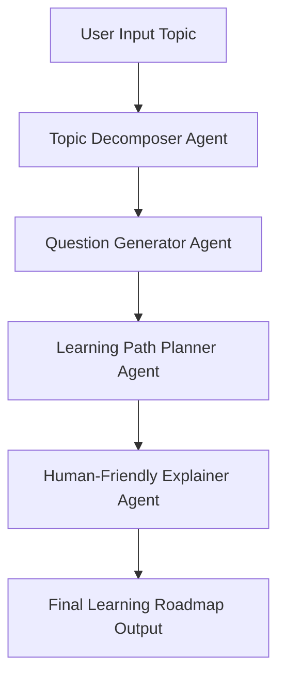

# 🤖 AI Research Assistant (Sequential CrewAI)

    

---

## 📌 Overview

**AI Research Assistant** is a **sequential multi-agent system** built using **CrewAI** that transforms a **raw learning topic** into a **structured, beginner-to-advanced learning roadmap**.

Instead of relying on a single LLM prompt, this project uses **multiple specialized agents**, each responsible for one cognitive step—just like a human expert team.

---

## 🎯 What Problem Does This Solve?

When learning a new topic, beginners often face:

* Unclear learning order
* Missing fundamentals
* Overwhelming resources
* Shallow explanations

This system solves that by:

* Decomposing the topic
* Generating deep guiding questions
* Structuring a logical learning path
* Explaining everything in human-friendly language

---

## 🧠 Core Idea (Mental Model)

Think of this system like a **learning factory**:

```
Raw Topic
   ↓
Topic Decomposer
   ↓
Question Generator
   ↓
Learning Path Planner
   ↓
Human-Friendly Explainer
   ↓
Structured Learning Guide
```

Each agent:

* Has **one clear role**
* Depends on **previous agent output**
* Cannot skip or overlap responsibilities

---

## 🏗️ Architecture Overview

### 🔹 Agents Used

| Agent Name            | Responsibility                           |
| --------------------- | ---------------------------------------- |
| Topic Decomposer      | Breaks topic into logical subtopics      |
| Question Generator    | Creates deep questions per subtopic      |
| Learning Path Planner | Orders learning from beginner → advanced |
| Human Explainer       | Converts plan into readable guidance     |

---

## 🔄 Sequential Agent Flow (Mermaid Diagram)



---

## ⚙️ How the System Works (Step-by-Step)

### Step 1: Input

You provide a **single topic**, for example:

```
"Polars for Data Science"
```

---

### Step 2: Topic Decomposition

The system:

* Identifies prerequisites
* Breaks the topic into atomic subtopics
* Ensures no conceptual gaps

Example output:

* Basics of Polars
* Expressions
* Lazy vs Eager Execution
* GroupBy & Aggregations
* Joins
* Performance Optimization

---

### Step 3: Question Generation

For each subtopic, the system generates:

* Beginner questions (conceptual)
* Intermediate questions (practical reasoning)
* Advanced questions (optimization & edge cases)

---

### Step 4: Learning Path Planning

Subtopics are grouped into **stages**, such as:

* Foundations
* Core Operations
* Advanced Optimization

Each stage includes:

* Concepts covered
* Key questions
* Expected learning outcome

---

### Step 5: Human-Friendly Explanation

The final agent:

* Explains **why** this order matters
* Sets learning expectations
* Reduces beginner intimidation

The final output is saved as:

```
study-plans/planning.md
```

---

## 🧪 Example Input & Output

### 🔹 Input

```text
Topic: "SQL Joins"
```

### 🔹 Output (Summary)

```text
Stage 1: Relational Thinking
Stage 2: Inner & Outer Joins
Stage 3: Complex Join Conditions
Stage 4: Performance Considerations
```

---

## 🚀 How to Run the Project

### 1️⃣ Clone the Repository

```bash
git clone https://github.com/your-username/ai-research-assistant.git
cd ai-research-assistant
```

---

### 2️⃣ Create Virtual Environment

```bash
python -m venv .venv
source .venv/bin/activate  # Windows: .venv\Scripts\activate
```

---

### 3️⃣ Install Dependencies

```bash
pip install -r requirements.txt
```

(or via `pyproject.toml` if using Poetry/UV)

---

### 4️⃣ Add Environment Variables

Create a `.env` file:

```env
OPENAI_API_KEY=your_api_key_here
```

---

### 5️⃣ Run the System

```bash
python src/my_project/main.py
```

---

## 🧠 Why This Project Is Strong

✅ Demonstrates **multi-agent orchestration**
✅ Shows **system design thinking**
✅ YAML-driven configuration
✅ Easy to extend and debug
✅ Beginner-friendly yet industry-relevant

This is **much stronger** than a single-prompt LLM project.

---

## 🔧 Customization Ideas

You can easily extend this project by adding:

* A **Resource Curator Agent**
* Difficulty tagging (Beginner / Intermediate / Advanced)
* Streamlit UI
* CSV or JSON export
* Memory / RAG using documents

---

## 🧩 Technologies Used

* **Python**
* **CrewAI**
* **YAML-based agent configuration**
* **LLMs (OpenAI / compatible providers/ Open Source)**

---

## 📌 Future Roadmap

* [ ] Add evaluation/scoring agent
* [ ] Add UI interface
* [ ] Add dataset/topic history
* [ ] Add RAG-based learning resources

---

## 🧑‍💻 Author

**Rudra Prasad Bhuyan**
Beginner Data Analyst | Multi-Agent System Enthusiast

* GitHub: [https://github.com/Rudra-G-23](https://github.com/Rudra-G-23)
* LinkedIn: [https://www.linkedin.com/in/rudra-prasad-bhuyan-44a388235](https://www.linkedin.com/in/rudra-prasad-bhuyan-44a388235)

<!-- Two Master Repo Links -->
<p align="center">
  <a href="https://github.com/Rudra-G-23/Data-Science-Roadmap">
    
  </a>
  <a href="https://github.com/Rudra-G-23/Data-Science-Projects-Portflio">
    
  </a>
</p>
---

## 📜 License

This project is licensed under the **MIT License**.

---
